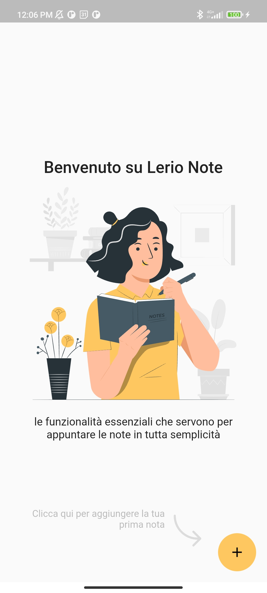
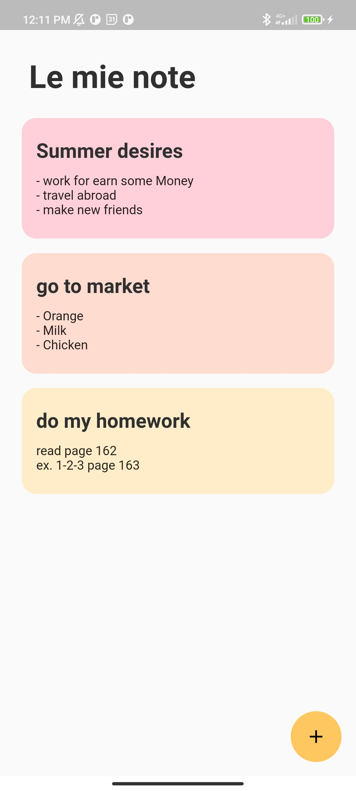
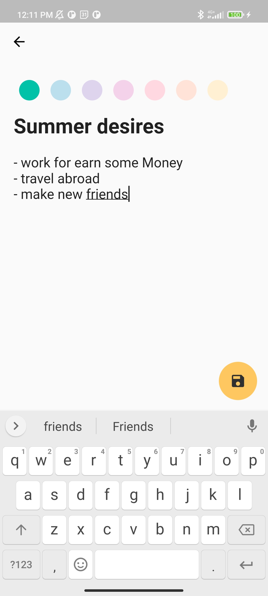
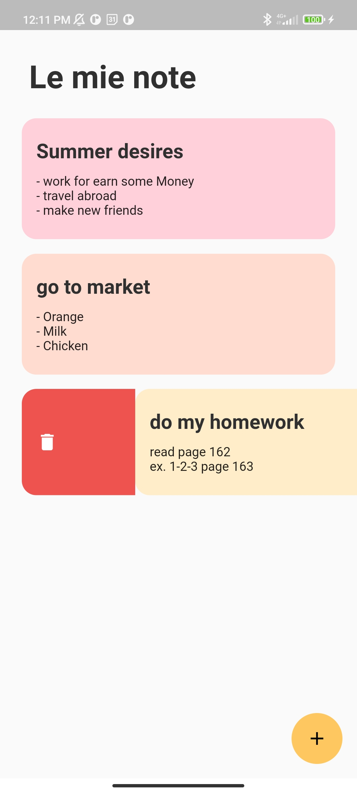
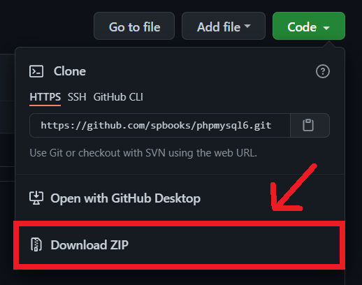

# **LerioNote**


### Summary
1. [What is LerioNote](#1---what-is-lerionote)
2. [How does it work](#2---how-does-it-work)
3. [Project structure](#3---project-structure)
4. [How to download code](#4---how-to-download-code)


## 1 - What is LerioNote
***
a simple application made in flutter with the purpose of writing notes in a simple and minimal way
<p align="center">
  
  
</p>


## 2 - How does it work
***
After clicking on the "+" button on the homepage screen (previous image) we can :
- select the color of the note
- give a title
- write the content

And finally, click save button for store a note in your phone.

### **Create a note**
<p align="center">
    
</p>

Then, if you want to remove a note, you simply swipe
### **Remove a note (with swipe)**
<p align="center">
  
  
</p>


## 3 - Project structure
***
Before downloading the code I suggest you explore the directory structure<br>

```
.
├── ...
├── assets                      
│   ├── icons          
│   └── images
│
├── build             
├── lib              
│   ├── db                      
│   │   └── notes_database.dart
│   │
│   ├── models                  
│   │   └── note.dart
│   │
│   ├── screens 
│   │   ├── homepage  
│   │   │   ├── homepage.dart
│   │   │   └── components
│   │   │       └── ....
│   │   │
│   │   ├── edit_add_note_screen       
│   │   │   ├── edit_add_note_screen.dart
│   │   │   └── components
│   │   │       └── ....  
│   │   │ 
│   │   └── splash_screen
│   │       └── splash_screen.dart
│   │   
│   ├── constants.dart  
│   ├── routes.dart  
│   └── main.dart                    
│   
├── test  
├── ...
├── ...
├── pubspech.lock
└── pubspech.yaml     

```

## 4 - How to download code
***
The code can be downloaded easily in two ways:
* By cloning the Repository
```
 git clone https://example.com
```

or

* By making the Download from the Git Hub
 by clicking on the **Code** button then on **"Download ZIP "**



***image assets downloaded by https://storyset.com/
